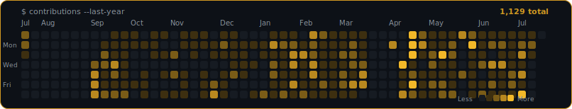

<!--
  Profile README · anonymmized (Insany) · dark-minimalist · infosec
  Accent color: #d29922 (amber). Re-theme by editing assets/*.svg + the hex in URLs.
  Frame + dividers are self-hosted SVGs in ./assets (no external services, cannot 503).
-->


<div align="center">


<br/>


&nbsp;
<a href="https://github.com/anonymmized?tab=followers">
  
</a>

</div>


## `$ whoami`

```text
Insany — information security specialist.

I design and build low-level security tools and terminal-first
utilities, with a focus on predictability, minimal dependencies,
and offline operation. My work centers around systems programming
and security tooling that can be audited, reasoned about, and
deployed without external services.
```

**Areas of focus**
- Low-level security tooling in **C / C++**
- Linux internals and system hardening
- Reverse engineering and binary analysis
- Minimal, auditable CLI utilities

**Engineering principles**
- Simple tools that do one thing well
- No unnecessary abstractions
- No hidden APIs or cloud dependencies
- Security should be understandable, not magical

> `if a tool requires internet access, it increases the attack surface.`


## `$ cat stack.txt`

<div align="center">

**Languages**


**Security & Systems**


**Environment**


</div>


## `$ ./stats.sh`

<div align="center">


</div>


## `$ git log --activity`

<div align="center">

<!-- Self-hosted dark contribution calendar (assets/calendar-dark.svg, refreshed by calendar.yml) -->


</div>


## `$ ./contact`

<div align="center">

<a href="https://github.com/anonymmized">
  
</a>
<!-- Add your own links:
<a href="TELEGRAM_LINK"></a>
<a href="mailto:EMAIL"></a>
-->

</div>


