# Hi  My name is Insany

## InfoSec Specialist

- ✉️  You can contact me at [insanyyi@proton.me](mailto:insanyyi@proton.me)

## Skills

  
  
  
  
  
  
  
  
  
  
  
  
  
  
  
  
  
  
  

## Socials

  <a href="https://www.github.com/anonymmized" target="_blank" rel="noreferrer">
    <picture>
      <source media="(prefers-color-scheme: dark)" srcset="https://raw.githubusercontent.com/danielcranney/readme-generator/main/public/icons/socials/github-dark.svg" />
      <source media="(prefers-color-scheme: light)" srcset="https://raw.githubusercontent.com/danielcranney/readme-generator/main/public/icons/socials/github.svg" />
      
    </picture>
  </a>
  <a href="https://www.x.com/anonymmizd" target="_blank" rel="noreferrer">
    <picture>
      <source media="(prefers-color-scheme: dark)" srcset="https://raw.githubusercontent.com/danielcranney/readme-generator/main/public/icons/socials/twitter-dark.svg" />
      <source media="(prefers-color-scheme: light)" srcset="https://raw.githubusercontent.com/danielcranney/readme-generator/main/public/icons/socials/twitter.svg" />
      
    </picture>
  </a>

## Badges

**My GitHub Stats**

**Top Repositories**

  
  

       

     

  
  

